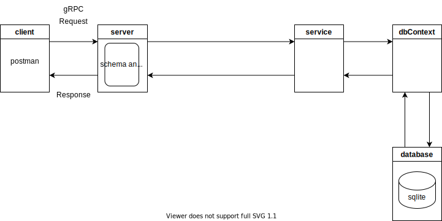

# node-js-grpc-sqlite-api

A simple api using node.js/grpc and sqlite

## Requirements

* node.js ([https://nodejs.dev/learn/making-http-requests-with-nodejs](https://))
* grpc-js and pro-loader ([https://github.com/grpc/grpc-node](https://))
* sqlite ([https://sqlite.org/index.html](https://))
* sqlite3 ([https://github.com/mapbox/node-sqlite3](https://))
* Postman (optional for testing api)
* SQLiteStudio (optional for managing database) ([https://sqlite.org/index.html](https://))

## Diagram



## Components

* **Config (config.js)**

  - configuration file
* **Server (server.js)**

  - creates grpc server and listens on a port 3000
  - loads proto file, defines resolver (taskResolver.js)
* **Service (taskService.js)**

  - handles business logic
* **Schema (task.proto)**

  - defines schema for Task Entities and Service
* **dbContext (dbContext.js)**

  - handles db connection
* **database (sqlite)**

  - sqlite database

## Run

Run the following command from the root directory:

```
node .\server.js
```

## Tests

Try the following in Postman.

**Setup:**

- New -> gRPC Request
- Enter Server URL
- Choose a way to load services..... (load proto file)
- Select methods and set Request message if applicable
- Invoke method

**CRUD:**

* GetTasks

  * http://127.0.0.1:3000
  * gRPC Request - > Message

  ```

  ```
* GetTask

  * http://127.0.0.1:3000
  * gRPC Request - > Message

  ```
  {
    "id": "1"
  }
  ```
* AddTask

  * http://127.0.0.1:3000/graphql/task
  * gRPC Request - > Message

  ```
  {
      "name": "task2", "description": "task2", "priority": "low", "status": "none"
  }
  ```
* UpdateTask

  * http://127.0.0.1:3000/graphql/task
  * gRPC Request - > Message

  ```
  {
      "name": "task22", "description": "task22", "priority": "low", "status": "none"
  }
  ```
* DeleteTask

  * http://127.0.0.1:3000/graphql/task
  * gRPC Request - > Message

  ```
    {
        "id": "2"
    }
  ```
